# IT304S: Contratação de Energia para Grandes Clientes
## Prof. Dr. Luiz Carlos Pereira da Silva

# UFRJ - Centro de Tecnologia/CT
## Grupo 5
* Douglas Machado Côrtes RA: 233270
* Hever Alcahuaman Villanueva RA: 228105
* Luís Henrique Bandória RA: 156449
* Roberto Tilhaqui Junior RA: 233671

# Introdução

A comercialização de energia no Brasil é realizada em duas esferas de mercado: o Ambiente de Contratação Regulada (ACR) e o Ambiente de Contratação Livre (ACL). Todos os contratos, sejam do ACR ou do ACL, têm de ser registrados na CCEE, e servem de base para a contabilização e liquidação das diferenças no mercado de curto prazo. A diferença entre os dois tipos de contração encontra-se no quadro mostrado na Figura 1.

| 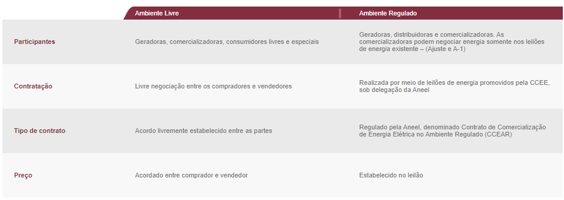 |
| :---: |
| Figura 1 – Quadro comparativo de contratação (Extraído de CCEE, 2020. https://www.ccee.org.br/portal) |

A CCEE faz a gestão dos ambientes de comercialização de energia elétrica, registrando contratos firmados entre geradores, comercializadores, distribuidores e consumidores livres. O painel Geração centraliza as principais informações sobre a geração de energia elétrica no SIN (Sistema Interligado Nacional), onde apresentam dados contabilizados referentes aos últimos 5 anos sobre a geração das usinas em operação comercial, capacidade instalada, garantia física apurada e fator de ajuste do MRE, entre outras variáveis.  
Em 16/12/2019 o Ministério de Minas e Energia (MME) publicou a Portaria nº 465/2019 que estabelece os prazos de início dos novos limites de migração de consumidores de energia elétrica para o Ambiente de Contratação Livre ACL. O novo texto abre a possibilidade de migração ao ACL "a partir de 1 º de janeiro de 2021 para os consumidores com carga igual ou superior a 1.500 kW."  

O Centro de Tecnologia(CT) da Universidade Federal do Rio de Janeiro (UFRJ) está no mercado cativo, onde a distribuição de energia é através da concessionária LIGHT Serviços de Eletricidade S/A. O CT está localizado na cidade do Rio de Janeiro, no campus da Cidade Universitária da Ilha do Fundão. A modalidade tarifária é THS Verde A4, classe Poder Público Federal.

## Estudo de caso do CT/UFRJ

Atualmente, a demanda contratada é de 4913 kW, sendo assim possível realizar a migração para o Mercado Livre de Energia (MLE). Para se transferir para o sistema de livre mercado é necessário [2]: 
* **(i)** análise dos contratos vigentes do CT e do perfil de consumo da comunidade acadêmica destes prédios, e estudo de viabilidade econômica da migração; 
* **(ii)** iniciar o processo de adesão; 
* **(iii)** comprar energia para entrar no mercado livre;
* **(iv)** ajustar o sistema de medição (Sistema de Medição para Faturamento - SMF e Sistema de Telemetria); 
* **(v)** monitoramento e gestão do mercado; 
* **(vi)** participação na CCEE, com recomendação de que os consumidores de menor porte sejam representados por comercializadores varejistas.

Neste trabalho, foi realizado a análise do consumo de energia e foi possível obter informações para subsidiar a tomada de decisão para a migração. Foi possível ratificar que vale a pena migrar para o MLE como consumidor livre. A análise do consumo de energia elétrica dos últimos três anos – 2017, 2018 e 2019 (36 registros) apresentou os seguintes resultados:  

| 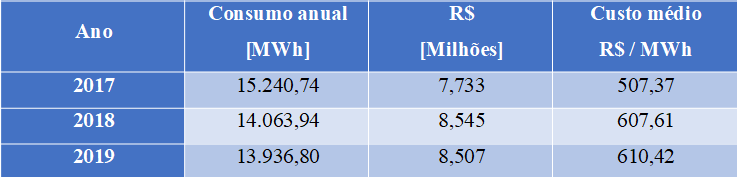 |
| :---: |
| Tabela 1 – Consumo anual e o valor total das faturas |
 
A tabela 2 apresenta a caracterização do consumo de energia ativa, na Ponta e Fora de Ponta, além das médias mensais e a média geral dos três anos. O consumo da potência reativa foi analisada na primeira parte deste trabalho. Logo, com base na média dos consumos de Ponta e Fora de Ponta, foram feitos o estudo de viabilidade econômica de migração. O consumo de energia ativa médio na ponta foi de 100,2 MWh e o fora de ponta foi 1.098,2 MWh.

| 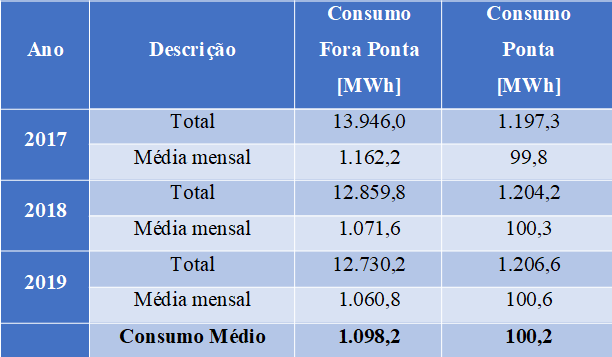 |
| :---: |
| Tabela 2 – Consumo Fora de Ponta e na Ponta |

A tabela 3 apresenta uma comparação entre os consumos de energia registrados, mínimo, médio e máximo para a análise financeira e estimativa de custos. Percebe-se o consumo de energia total, de 2017 para 2019, teve uma taxa de decrescimento de 8,6%. Sendo assim, o impacto de ações de eficiência energética no prédio e mais a migração para o MLE tem uma grande possibilidade de economia financeira para UFRJ através destas medidas.

| 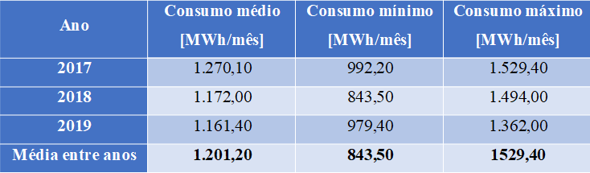 |
| :---: |
| Tabela 3 – Consumos médios, mínimo e máximo |

Após a avaliação do consumo de energia do CT, para concluir a estimativa de economia de energia foi preciso analisar dos pontos. A primeira análise do valor vigente das tarifas em do mercado cativo. E o segundo ponto um estudo das médias simples do Preço de Liquidação das Diferenças (PLD). 	

Logo, a composição da tarifa, na tabela 04, de acordo com a Resolução ANEEL Nº 2.667 de 13/03/2020 com vigência a partir de 15/03/2020. 

| 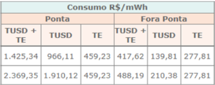 |
| :---: |
| Tabela 4 – Composição tarifária vigente (Fonte: Light, 2020) |
 
# Objetivos
Este trabalho tem como objetivo realizar diferentes análises para determinar a possibilidade de migração de um contrato de energia elétrica do Ambiente de Contratação Regulada para o Ambiente de Contratação Livre (ACR/ACL) como medida econômica. Esta análise está limitada unidade consumidora (Centro Tecnológico - UFRJ) descrita na primeira parte deste trabalho.

# Metodologia
Para conseguir prever a demanda de um mês futuro a partir dos dados disponíveis é necessário que a base de dados seja tratada. Remoção de dados nulos, remoção de outliers, imputação de dados faltantes são alguns dos pontos que podem ser analisados no banco de dados. Neste sentido, optou-se arbitrariamente por aplicar a metodologia `CRISP-DM (Cross-Industry Standard Process for Data Mining)` para a análise dos dados. Segundo esta metodologia, o problema deve ser dividido nas seguintes etapas:

* **Business Understanding:** Definição dos objetivos, declaração do problema (pergunta de interesse).
* **Data Understanding:** Utilização de nosso conhecimento para coletar os dados.
* **Data Preparation:** Manipulação de dados para a eliminação de outliers e dados faltantes.
* **Modeling:** Modelo ou abordagem utilizado para estudar o comportamento de nosso sistema a partir de nossos dados.
* **Evaluation:** Avaliação dos resultados obtidos, no contexto se são de ajuda para responder nossa pergunta de interesse.
* **Deployment:** Disponibilizar o análise de dados.

## Business Understanding
### Principais Considerações para a Migração para ACL

* **Definição dos objetivos:** O objetivo do presente trabalho é investigar a viabilidade da migração do CT/UFRJ para o Ambiente Livre de Contratação.

* **Declaração do problema:** Tratar os dados disponíveis das faturas e realizar a previsão da demanda.

* **Perguntas de Interesse:** É possível prever, com boa precisão, a demanda que será necessária em meses futuros?

## Data Understanding
Para todas as análises foram utilizadas as faturas mensais para os anos de 2017, 2018 e 2019. Estas faturas foram digitalizadas e estão disponíveis  em **data/Contas de energia UFRJ.xlsx.** Dessa forma, são esperados um total de 12 dados para cada categoria presente nas faturas. No entanto há faturas que não apresentam dados de todas as mencionadas categorias, como por exemplo as Tarifas de Ultrapassagem, que são cobradas somente nos meses em que há ultrapassagem acima de 5% da demanda contratada [5].

Neste estudo, as categorias ENERGIA HFP VERDE, ENERGIA HP VERDE, ENERGIA HFP AMAR, ENERGIA HP AMAR, ENERGIA HFP VERM e ENERGIA HP VERM estão presentes apenas nas faturas referentes aos meses em que as bandeiras tarifárias estão sendo aplicadas. Dessa forma, nos meses em que não há bandeira tarifária aplicada não há energia consumida sob uma dada bandeira e, consequentemente, não há acréscimos na fatura por conta de bandeiras tarifárias, e, portanto, as categorias Acrescimo Bamar, Acrescimo Bverm1 e Acrescimo Bverm2 não constarão nas faturas. Contudo, mesmo que nenhuma bandeira esteja aplicada as tarifas relacionadas a cada uma das bandeiras estão presentes em todos os meses (esta análise é mais detalhada no estudo preliminar).

## Data Preparation
As faturas de energia elétrica disponíveis foram digitalizadas em uma planilha eletrônica. Um pequeno trecho dessa planilha é mostrado abaixo. 

O primeiro passo é observar a presença dos valores "NaN" (not a number): valores que não são reconhecidos pela linguagem Python. Portanto, é necessário realizar a remoção destes valores da base de dados substituindo-os por "0" (zeros) uma vez que são dados inexistentes.

| 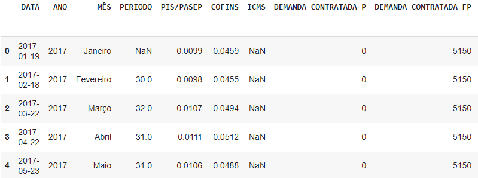 |
| :---: |
| Figura 2 – Trecho da planilha digitalizada. |

Após a substituição dos dados "NaN" por zeros, é necessário identificar os dados nulos presentes na base de dados. Dados nulos tipicamente aparecem no banco de dados por falhas no preenchimento das planilhas ou falhas na comunicação entre os medidores e a base de dados, sendo necessário identificá-los. 

A figura abaixo mostra o total de dados para cada categoria da base de dados, juntamente com a porcentagem de dados nulos naqueles campos em que estes estão presentes.

| 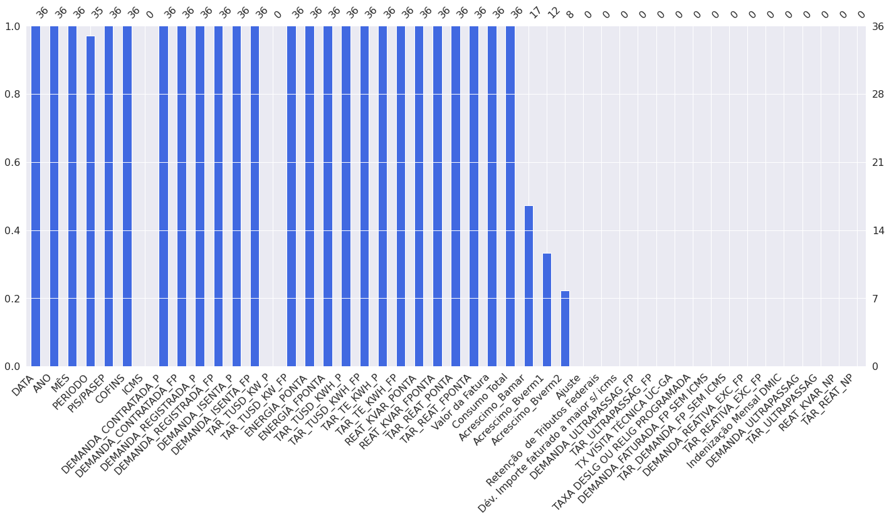 |
| :---: |
| Figura 3 – Representação em barras dos dados faltantes. |

| 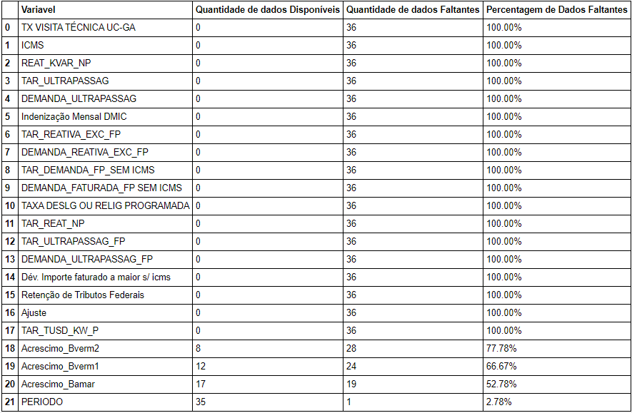 |
| :---: |
| Figura 4 – Representação percentual dos dados faltantes. |

Como têm-se dados dos anos de 2017, 2018 e 2019, espera-se que cada campo tenha um total de 36 valores. Pode ser observado que isso não é verdade para todos os campos disponíveis. Para se ter uma melhor noção dos dados faltantes, é mostrado abaixo uma matriz de dados faltantes de onde pode ser visto que se há algum padrão ou algum tipo de correlação entre as variáveis faltantes.

| 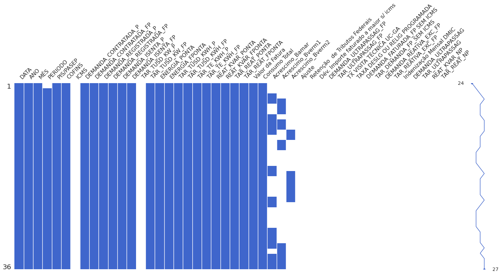 |
| :---: |
| Figura 5 – Matriz de dados faltantes. |

Pode ser observado que o campo ICMS não possui nenhum dado, o que já é esperado já que a UC estudada é isenta do pagamento deste tributo segundo o decreto nº43903 de 24/10/2012 do estado do Rio de Janeiro [6]. Os campos relacionados às bandeiras tarifárias apresentam um elevado número de dados faltantes, onde isso pode ser justificado devido à natureza da aplicação das bandeiras tarifárias. Além disso, não há correlação entre as bandeiras tarifárias, pois apenas uma bandeira tarifária pode ser aplicada sobre o consumo por vez. Os demais campos não possuem dados já que não estão disponíveis nas faturas de energia elétrica. Para este trabalho optou-se arbitrariamente por selecionar apenas os campos que possuem mais de 50% de dados disponíveis, ou seja, apenas a variável PERÍODO. Abaixo pode ser observado o comportamento individual de cada variável estudada.

| 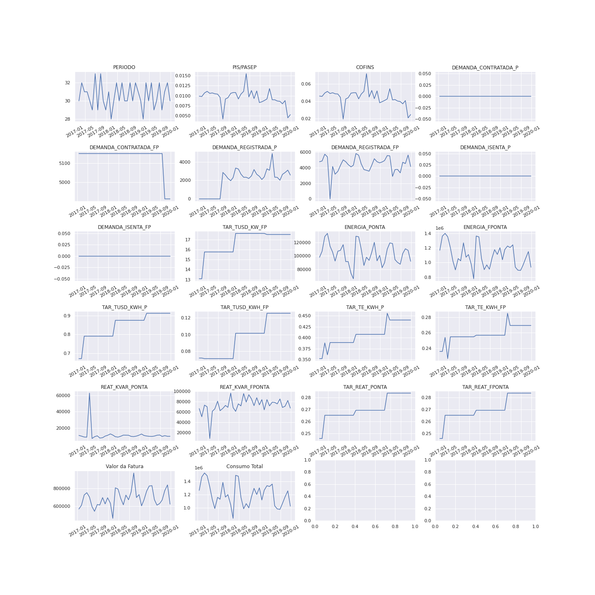 |
| :---: |
| Figura 6 – Variáveis analisadas - Sem tratamento. |

### Imputações
Buscando um banco de dados uniforme e melhor condicionado, pode-se empregar algum técnica para criar artificialmente o valor faltante da varável PERÍODO. Para este trabalho optou-se arbitrariamente em utilizar a técnica de Imputação pela Moda. Diversas técnicas de imputação estão presentes na literatura, como imputação pela média e imputação quadrática. Contudo, como o PERÍODO é medido em dias, o que representa um número inteiro, a imputação pela moda se mostra mais adequada não tendo risco de que a imputação ocorra a partir de um valor não-inteiro. Abaixo é mostrado o resultado da aplicação da imputação pela moda na variável PERÍODO.

| 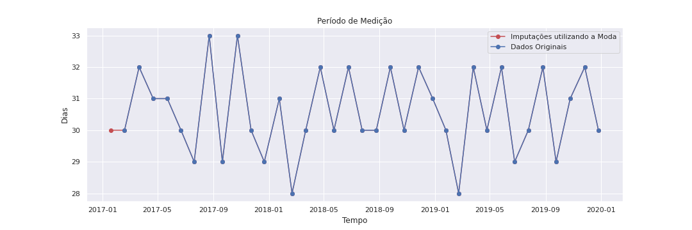 |
| :---: |
| Figura 7 – Variável PERÍODO após a Imputação. |

Após a remoção dos dados nulos o banco de dados fica completo, como pode ser observado a partir da matriz de dados abaixo.

| 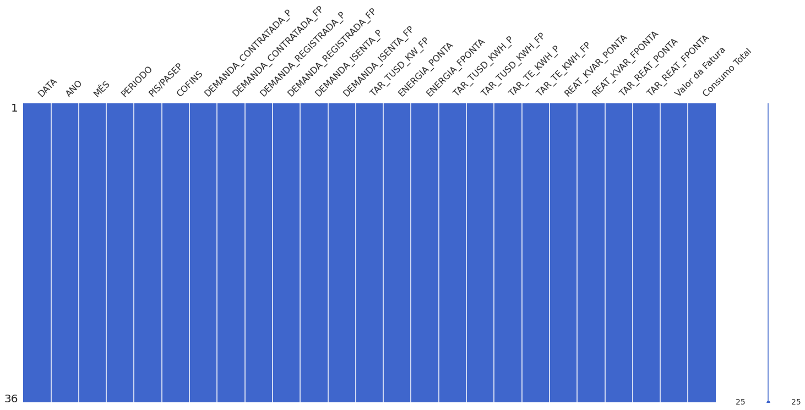 |
| :---: |
| Figura 8 – Matriz de dados faltantes após a Imputação. |

### Remoção de Outliers
Outro aspecto importante é a identificação de dados com comportamento atípico, chamados outliers, que podem  ser observados nos dados. Por exemplo, o pico presente na variável REAT_KVAR_PONTA distoa muito do restante dos dados, possivelmente devido a um erro de digitalização. Uma forma simples de identificação de outliers são os chamados Box Plot, que mostram a média do valor apresentado juntamente com a margem de erro estipulada. Qualquer valor fora dessa margem de erro é chamado de outlier. Abaixo são apresentados os Box Plot de todas as variáveis estudadas.

| 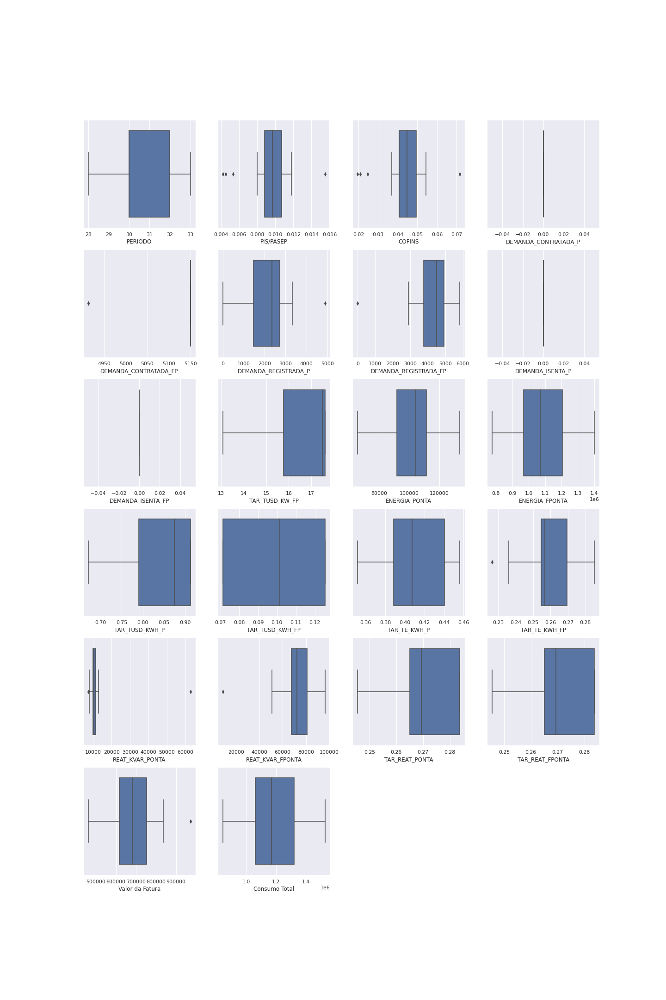 |
| :---: |
| Figura 9 – Box Plot para identificação de outliers. |

Uma vez identificados os outliers é necessários removê-los e completar o espaço deixado com alguma técnica. Neste trabalho optou-se arbitrariamente por utilizar a técnica Interquartile Range para remover e subtituir os outliers. Após a substituição destes dados, as variáveis podem ser observadas abaixo. É também mostrado o Box Plot após a remoção dos outliers. Alguns campos como PIS/PASEP e COFINS foram verificados nas leis e estão corretos, apesar de serem identificados pelo Box Plot como outliers. Portanto, nenhuma alteração foi realizada sobre estes valores. A DEMANDA CONTRADA também apresenta outliers, porém de fato houve uma redução no valor da demanda contrada nos três meses finais de 2019 e portanto estes dados não foram alterados.

| 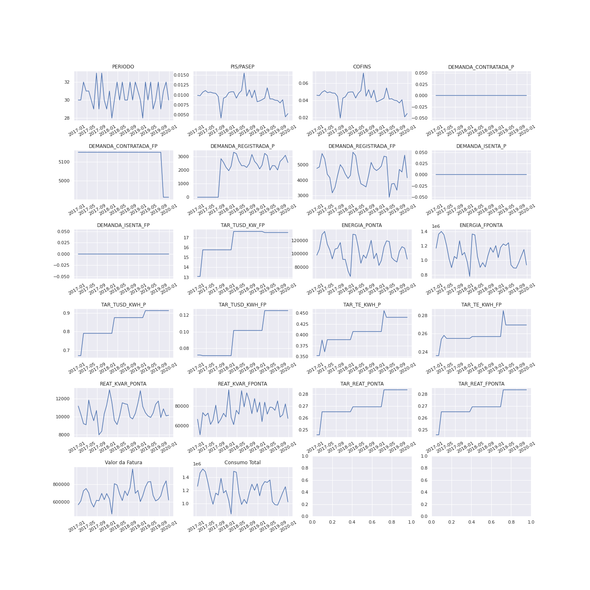 |
| :---: |
| Figura 10 – Variáveis analisadas - Após o tratamento. |

| 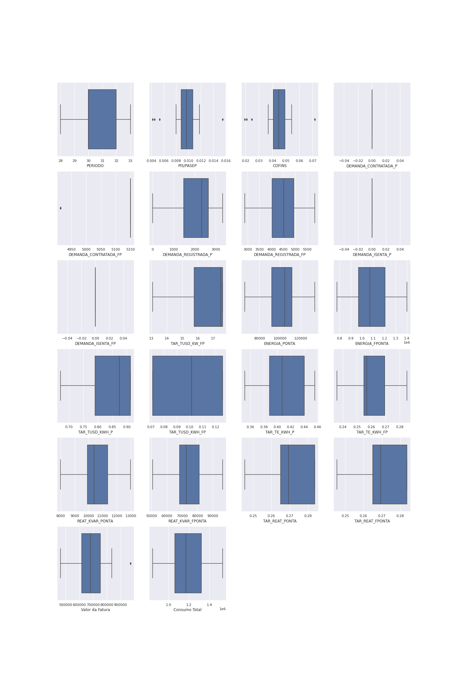 |
| :---: |
| Figura 11 – Box Plot  - Após o tratamento. |

# Modeling

Uma vez que os dados foram devidamente tratados é necessária realizar a modelagem dos dados. Para isso foi utilizado arbitrariamente a modelagem Arima, um modelo utilizado para modelagem de dados periódicos. Como a intenção do trabalho é prever a demanda da UC, estes dados foram divididos em dois grupos: dados de treino e dados de teste, mostrados abaixo.

| 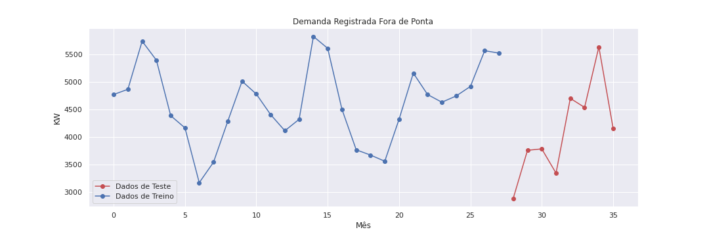 |
| :---: |
| Figura 12 – Dados de Teste e de Treino. |

# Evaluation

Aplicando a modelagem Arima sobre esta variável, obtém-se o resultado mostrado abaixo. Pode-se observar que o modelo obtido se ajusta aos dados dentro de uma margem de erro, o que mostra que é de fato possível utilizar o Arima para prever a demanda da UC estudada. Deve-se estipular uma margem de erro adequada para realizar contratações acertivas, evitando contratar menos do que o necessário, o que pode resultar em falta de abastecimento. No mercado de energia, o excedente não é tão problemático pois pode ser revendido ao preço do PLD.

| 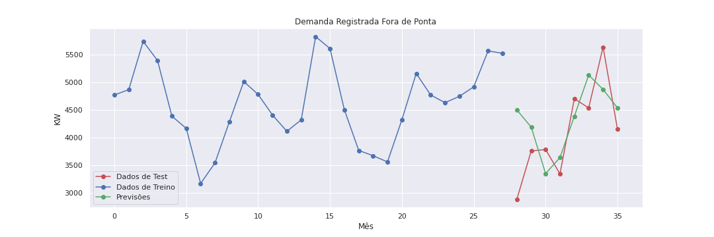 |
| :---: |
| Figura 13 – Previsão utilizando Arima. |

# Deploiment

A base de dados resultante da análise realizada se encontra disponível neste repositório **(data/UFRJ_-_Final.xlsx)**. A partir dos resultados obtidos é possível concluir que a base de dados disponível, isto é, três anos de faturas, juntamente com o tratamento de dados realizado é suficiente para prever a demanda total da UC. Com uma base de dados maior e mais completa é possível realizar previsões ainda mais acertivas.

# Análise de viabilidade econômica da migração 

O cálculo da Média Mensal é feita considerando a média simples do PLD de todas as horas do mês e para cada submercado do Sistema Elétrico Brasileiro, divididos atualmente em quatro submercados: Norte, Nordeste, Sudeste/Centro-Oeste e Sul. Para o período anterior a 1° de janeiro de 2021, a média mensal do PLD considerava os valores do PLD semanal por patamar de carga - leve, médio e pesado - ponderado pelo número de horas de cada patamar e em cada semana do mês, com base na metodologia que era vigente do cálculo do PLD (CCEE, 2020).  

A partir de 1° de janeiro de 2021, o PLD passou a ser calculado por submercado em base horária, de modo que a média mensal consiste na média simples de todas as horas do referido mês, e cuja informação se torna disponível apenas após a divulgação dos resultados do processamento do modelo DESSEM realizados no penúltimo dia do mês, referente aos valores de PLD para cada hora da último dia do mês em questão. Este modelo foi proposto pela Comissão Permanente para Análise de Metodologias e Programas Computacionais do Setor Elétrico (CPAMP) com cronograma de implantação definido pela Portaria MME 301/2019 (CCEE, 2020).  

No site do CCEE foi possível coletar os dados para o PLD Mensal, de janeiro de 2018 à dezembro de 2020 e o PLD Semanal, janeiro de 2019 à janeiro de 2021. Entretanto, para este estudo foi considerado o período de janeiro de 2019 à dezembro de 2020 para ambos PLD’s, com o objetivo de obter os cálculos médios das tarifas dos submercados para e estimativa financeira. É possível ver as comparações na tabela 05. A análise de dados observou variações nos PLD Mensal entre R$39,68 e R$ 505,18.  

|  |
| :---: |
| Tabela 5 – PLD Médio Semanal e Mensal de 2019 e 2020 |
 
 Considerou-se os valores máximos e mínimos do PLD Médio, R$ 220,64/MWh, do submercado SUL e R$ 152,45/MWh, do submercado NORDESTE.  
 
| 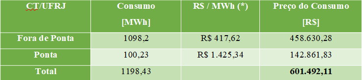 |
| :---: |
| Tabela 6 – Estimativa de preço do consumo de energia no mercado cativo | 	
(*) tarifa Light (TUSD + TE)
 
| 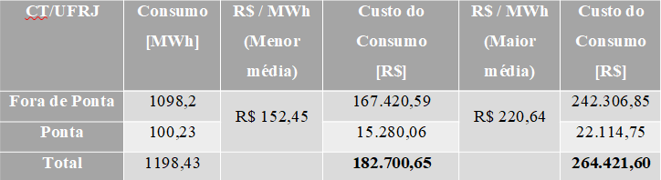 |
| :---: |
| Tabela 7 – Estimativa de preço para o PLD Médio Semanal e Mensal no MLE. | 
 
Contudo, observando os valores das duas estimativas de contrato, Cativo e Livre, comparando os dois preços praticados no MLE, R$182.700,65 e R$264.421,60, com o preço do consumo atual de aproximadamente R$604.492,11, temos que a diferença entre a maior tarifa média seria de R$ 337.070,52 representando 56%. Por outro lado, temos que a diferença entre a menor tarifa média encontrada seria ainda maior de R$ 418.791,46 representando 70% de economia estimada. Portanto, uma redução poderia ser entre 56% e 70%.

Em outra análise, poderá ser feita considerando os valores reais máximos e mínimos registrados nos consumos do CT/UFRJ, respectivamente, 843,5 MWh, em 2018 e 1529,4 MWh em 2017. Assim, como pode ser visto na tabela 08:  

| 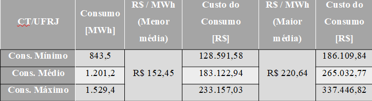 |
| :---: |
| Tabela 8 – Estimativa de preços sobre o consumo mínimo e máximo registrado. | 

# Conclusão  

Portanto, após estas análises, percebe-se que é viável para a UFRJ/CT iniciar um projeto piloto na unidade mais consumidora, para efeito de aprendizado e incentivo a outras unidades dentro da instituição e outras universidades públicas e privadas.  
O gerenciamento do risco é de extrema importância, inclusiva a capacitação e treinamento de uma equipe de servidores que possa estar acompanhando toda a implantação deste projeto. Outrossim, é a possibilidade de estudos mais estatísticos sobre os PLD’s passados e a nova metodologia de precificação do PLD.
Além disso, deverá ser considerada a Taxa de Adesão (Emolumento) R$ 5.898,00, o ajuste do Sistema de Medição e a subestação estimado entre R$20.000,00 a R$50.000,00, o custo da taxa de contribuição associativa sobre os MWh comercializados, atualmente no valor de R$ 0,096 R$/MWh mensal, entre R$80,98 e R$146,82.
Quanto aos riscos de se realizar a migração, o principal deles está ligado a um possível não pagamento de conta. Diferente do contrato de fornecimento com a Light, o não pagamento de uma fatura representa, em um primeiro momento, a cobrança de uma conta com preço variável, que pode ser maior que o valor contrato, e no segundo momento o corte da energia. Ademais, havendo o desejo de se retomar o contrato junto a concessionária, este não poderia ser feito de imediato. A concessionária, por lei, tem até cinco anos para aceitar um consumidor de volta. Um segundo risco está relacionado ao histórico de inadimplência da UFRJ, pois as empresas que vendem energia ficam receosas em celebrar contratos com a UFRJ.  
Porém, existem alternativas para reduzir o impacto dos riscos elencados. Como, por exemplo, utilizar recursos transferidos, através do Decreto Estadual (RJ) N°43.903/2012 para o Fundo Verde como garantidor de pagamento. Dessa forma, durante um período determinado, o Fundo Verde poderia contingenciar um determinado recurso e assim dar segurança ao mercado para fornecer energia a UFRJ.
